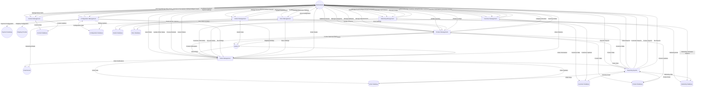

```mermaid
flowchart TD
    %% External Entities
    Admin((Administrator))
    Vendor((Vendor))
    PaymentGateway((Payment Gateway))
    ShippingProvider((Shipping Provider))
    EmailServer((Email Server))
    
    %% Processes
    P1[Product Management]
    P2[Order Management]
    P3[Customer Management]
    P4[Content Management]
    P5[Marketing Management]
    P6[Configuration Management]
    P7[Reporting System]
    P8[Vendor Management]
    P9[Store Management]
    
    %% Data Stores
    DS1[(Product Database)]
    DS2[(Customer Database)]
    DS3[(Order Database)]
    DS4[(Content Database)]
    DS5[(Configuration Database)]
    DS6[(Marketing Database)]
    DS7[(Vendor Database)]
    DS8[(Store Database)]
    
    %% Data Flows - Admin Interactions
    
    %% Product Management
    Admin -->|Add/Edit Products| P1
    Admin -->|Manage Categories| P1
    Admin -->|Manage Attributes| P1
    Admin -->|Manage Manufacturers| P1
    Admin -->|Update Inventory| P1
    P1 -->|Product Listings| Admin
    P1 -->|Category Structure| Admin
    P1 -->|Inventory Status| Admin
    
    %% Order Management
    Admin -->|View Orders| P2
    Admin -->|Update Order Status| P2
    Admin -->|Process Refunds| P2
    Admin -->|Cancel Orders| P2
    P2 -->|Order Details| Admin
    P2 -->|Order Statistics| Admin
    
    %% Customer Management
    Admin -->|View Customers| P3
    Admin -->|Edit Customer Details| P3
    Admin -->|Manage Customer Roles| P3
    Admin -->|Impersonate Customer| P3
    P3 -->|Customer Information| Admin
    P3 -->|Customer Activity| Admin
    
    %% Content Management
    Admin -->|Edit Pages| P4
    Admin -->|Manage Blog Posts| P4
    Admin -->|Manage News Items| P4
    Admin -->|Update Media| P4
    P4 -->|Content Preview| Admin
    
    %% Marketing Management
    Admin -->|Create Discounts| P5
    Admin -->|Manage Promotions| P5
    Admin -->|Configure Email Campaigns| P5
    P5 -->|Campaign Performance| Admin
    P5 -->|Discount Usage| Admin
    
    %% Configuration Management
    Admin -->|Update Settings| P6
    Admin -->|Configure Taxes| P6
    Admin -->|Configure Shipping| P6
    Admin -->|Configure Payment Methods| P6
    P6 -->|System Settings| Admin
    
    %% Reporting System
    Admin -->|Request Reports| P7
    P7 -->|Sales Reports| Admin
    P7 -->|Customer Reports| Admin
    P7 -->|Product Reports| Admin
    P7 -->|Tax Reports| Admin
    
    %% Vendor Management
    Admin -->|Manage Vendors| P8
    Admin -->|Review Vendor Products| P8
    P8 -->|Vendor Information| Admin
    P8 -->|Vendor Performance| Admin
    
    %% Store Management
    Admin -->|Configure Stores| P9
    Admin -->|Manage Multi-store Settings| P9
    P9 -->|Store Configuration| Admin
    
    %% External System Interactions
    P6 <-->|Payment Configuration| PaymentGateway
    P6 <-->|Shipping Configuration| ShippingProvider
    P2 -->|Order Notifications| EmailServer
    P5 -->|Marketing Emails| EmailServer
    
    %% Vendor Interactions
    Vendor -->|Submit Products| P1
    Vendor -->|View Orders| P2
    P1 -->|Product Approval Status| Vendor
    P2 -->|Order Information| Vendor
    P8 <-->|Vendor Data| Vendor
    
    %% Data Store Interactions
    P1 <-->|Product Data| DS1
    P1 -->|Product Updates| DS1
    
    P2 <-->|Order Data| DS3
    P2 -->|Order Updates| DS3
    
    P3 <-->|Customer Data| DS2
    P3 -->|Customer Updates| DS2
    
    P4 <-->|Content Data| DS4
    P4 -->|Content Updates| DS4
    
    P5 <-->|Marketing Data| DS6
    P5 -->|Marketing Campaign Updates| DS6
    
    P6 <-->|Configuration Data| DS5
    P6 -->|Setting Updates| DS5
    
    P7 <-->|Order Data| DS3
    P7 <-->|Customer Data| DS2
    P7 <-->|Product Data| DS1
    P7 <-->|Marketing Data| DS6
    
    P8 <-->|Vendor Data| DS7
    P8 -->|Vendor Updates| DS7
    
    P9 <-->|Store Data| DS8
    P9 -->|Store Updates| DS8
    
    %% Cross-Process Data Flows
    P1 -->|Product Data| P7
    P2 -->|Order Data| P7
    P3 -->|Customer Data| P7
    
    P1 -->|Product Information| P2
    P3 -->|Customer Information| P2
    
    P5 -->|Discount Rules| P2
    P6 -->|Tax Settings| P2
    P6 -->|Shipping Settings| P2
    
    P8 -->|Vendor Products| P1
    P9 -->|Store Settings| P1
    P9 -->|Store Settings| P2
```
