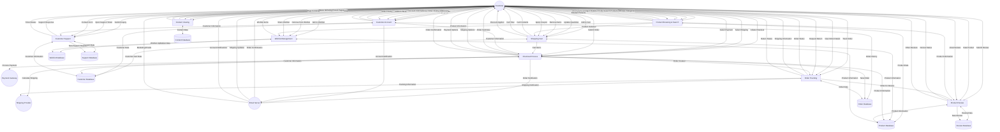

```mermaid
flowchart TD
    %% External Entities
    Customer((Customer))
    PaymentGateway((Payment Gateway))
    ShippingProvider((Shipping Provider))
    EmailServer((Email Server))
    
    %% Processes
    P1[Product Browsing & Search]
    P2[Shopping Cart]
    P3[Customer Account]
    P4[Checkout Process]
    P5[Order Tracking]
    P6[Product Review]
    P7[Wishlist Management]
    P8[Content Viewing]
    P9[Customer Support]
    
    %% Data Stores
    DS1[(Product Database)]
    DS2[(Customer Database)]
    DS3[(Order Database)]
    DS4[(Content Database)]
    DS5[(Review Database)]
    DS6[(Wishlist Database)]
    DS7[(Support Database)]
    
    %% Data Flows - Customer Interactions
    
    %% Product Browsing & Search
    Customer -->|Browse Categories| P1
    Customer -->|Search Products| P1
    Customer -->|Filter Products| P1
    Customer -->|View Product Details| P1
    P1 -->|Product Listings| Customer
    P1 -->|Product Details| Customer
    P1 -->|Search Results| Customer
    P1 -->|Related Products| Customer
    
    %% Shopping Cart
    Customer -->|Add to Cart| P2
    Customer -->|Update Quantities| P2
    Customer -->|Remove Items| P2
    Customer -->|Apply Coupon| P2
    P2 -->|Cart Contents| Customer
    P2 -->|Cart Total| Customer
    P2 -->|Discount Applied| Customer
    
    %% Customer Account
    Customer -->|Register| P3
    Customer -->|Login| P3
    Customer -->|Update Profile| P3
    Customer -->|Manage Addresses| P3
    Customer -->|View Order History| P3
    P3 -->|Account Information| Customer
    P3 -->|Address Book| Customer
    P3 -->|Order History| Customer
    
    %% Checkout Process
    Customer -->|Initiate Checkout| P4
    Customer -->|Select Shipping| P4
    Customer -->|Select Payment| P4
    Customer -->|Submit Order| P4
    P4 -->|Order Summary| Customer
    P4 -->|Shipping Options| Customer
    P4 -->|Payment Options| Customer
    P4 -->|Order Confirmation| Customer
    
    %% Order Tracking
    Customer -->|Track Order| P5
    Customer -->|View Order Details| P5
    Customer -->|Request Return| P5
    P5 -->|Order Status| Customer
    P5 -->|Shipping Information| Customer
    P5 -->|Return Status| Customer
    
    %% Product Review
    Customer -->|Submit Review| P6
    Customer -->|Rate Product| P6
    Customer -->|View Reviews| P6
    P6 -->|Review Status| Customer
    P6 -->|Other Reviews| Customer
    
    %% Wishlist Management
    Customer -->|Add to Wishlist| P7
    Customer -->|Remove from Wishlist| P7
    Customer -->|Share Wishlist| P7
    P7 -->|Wishlist Items| Customer
    
    %% Content Viewing
    Customer -->|Read Blog| P8
    Customer -->|View News| P8
    Customer -->|Read Pages| P8
    P8 -->|Blog Posts| Customer
    P8 -->|News Items| Customer
    P8 -->|Page Content| Customer
    
    %% Customer Support
    Customer -->|Submit Inquiry| P9
    Customer -->|Open Support Ticket| P9
    Customer -->|Contact Form| P9
    P9 -->|Support Response| Customer
    P9 -->|Ticket Status| Customer
    
    %% External System Interactions
    P4 <-->|Process Payment| PaymentGateway
    P4 <-->|Calculate Shipping| ShippingProvider
    P5 <-->|Tracking Information| ShippingProvider
    
    %% Email Notifications
    EmailServer -->|Order Confirmation| Customer
    EmailServer -->|Shipping Updates| Customer
    EmailServer -->|Account Notifications| Customer
    EmailServer -->|Marketing Emails| Customer
    P4 -->|Order Notification| EmailServer
    P3 -->|Account Notification| EmailServer
    P5 -->|Shipping Notification| EmailServer
    
    %% Data Store Interactions
    P1 <-->|Product Data| DS1
    
    P2 <-->|Product Information| DS1
    P2 <-->|Customer Cart Data| DS2
    
    P3 <-->|Customer Data| DS2
    P3 <-->|Order History| DS3
    
    P4 <-->|Product Information| DS1
    P4 <-->|Customer Information| DS2
    P4 -->|New Order| DS3
    
    P5 <-->|Order Data| DS3
    
    P6 <-->|Product Information| DS1
    P6 <-->|Review Data| DS5
    P6 -->|New Review| DS5
    
    P7 <-->|Product Information| DS1
    P7 <-->|Wishlist Data| DS6
    P7 -->|Wishlist Updates| DS6
    
    P8 <-->|Content Data| DS4
    
    P9 <-->|Customer Information| DS2
    P9 <-->|Support Data| DS7
    P9 -->|New Support Request| DS7
    
    %% Cross-Process Data Flows
    P1 -->|Product Selected| P2
    P1 -->|Product Information| P6
    P1 -->|Product Information| P7
    
    P2 -->|Cart Items| P4
    
    P3 -->|Customer Information| P4
    P3 -->|Customer Information| P9
    
    P4 -->|Order Created| P5
    
    P5 -->|Order for Review| P6
```
