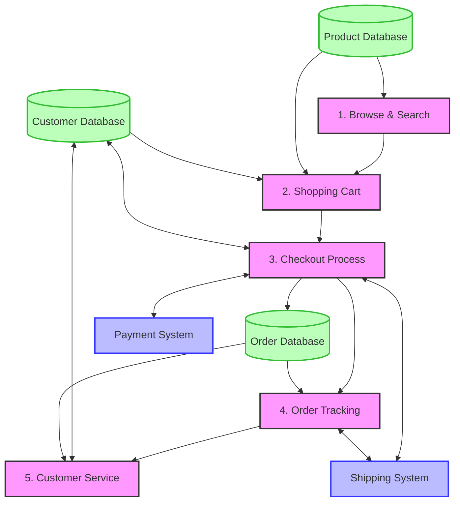

# Customer Journey Data Flow - Mermaid Version

## Data Flow Description

### 1. Browse & Search
- **Input**: Customer search queries, category selections
- **Output**: Product listings, details, images, prices
- **Data Source**: Product Database
- **Key Actions**: View products, filter results, compare items

### 2. Shopping Cart
- **Input**: Product selections, quantity changes
- **Output**: Cart contents, subtotals, available discounts
- **Data Source**: Product Database, Customer Database
- **Key Actions**: Add/remove items, update quantities, apply coupons

### 3. Checkout Process
- **Input**: Shipping address, payment details
- **Output**: Order confirmation, receipt
- **Data Destination**: Customer Database, Order Database
- **External Systems**: Payment gateway, tax calculator
- **Key Actions**: Select shipping method, make payment, place order

### 4. Order Tracking
- **Input**: Order ID, customer account
- **Output**: Order status, shipping updates
- **Data Source**: Order Database
- **External Systems**: Shipping carrier
- **Key Actions**: View order status, download invoice, request returns

### 5. Customer Service
- **Input**: Support requests, product questions
- **Output**: Support responses, return authorizations
- **Data Source**: Order Database, Customer Database
- **Key Actions**: Contact support, submit return requests, leave reviews
