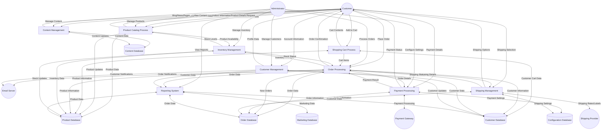

```mermaid
flowchart TD
    %% External Entities
    Customer((Customer))
    Admin((Administrator))
    PaymentGateway((Payment Gateway))
    ShippingProvider((Shipping Provider))
    EmailServer((Email Server))
    
    %% Processes
    P1[Product Catalog Process]
    P2[Shopping Cart Process]
    P3[Order Processing]
    P4[Customer Management]
    P5[Payment Processing]
    P6[Shipping Management]
    P7[Inventory Management]
    P8[Reporting System]
    P9[Content Management]
    
    %% Data Stores
    DS1[(Product Database)]
    DS2[(Customer Database)]
    DS3[(Order Database)]
    DS4[(Content Database)]
    DS5[(Configuration Database)]
    DS6[(Marketing Database)]
    
    %% Data Flows
    
    %% Customer Interactions
    Customer -->|Browse/Search Products| P1
    Customer -->|Product Details Request| P1
    P1 -->|Product Information| Customer
    P1 -->|Category/Brand Data| Customer
    
    Customer -->|Add to Cart| P2
    P2 -->|Cart Contents| Customer
    
    Customer -->|Account Information| P4
    P4 -->|Profile Data| Customer
    
    Customer -->|Place Order| P3
    P3 -->|Order Confirmation| Customer
    
    Customer -->|Payment Details| P5
    P5 -->|Payment Status| Customer
    
    Customer -->|Shipping Selection| P6
    P6 -->|Shipping Options| Customer
    
    Customer -->|View Content| P9
    P9 -->|Blog/News/Pages| Customer
    
    %% Admin Interactions
    Admin -->|Manage Products| P1
    Admin -->|Manage Customers| P4
    Admin -->|Process Orders| P3
    Admin -->|Configure Settings| P5
    Admin -->|Manage Content| P9
    Admin -->|View Reports| P8
    Admin -->|Manage Inventory| P7
    
    %% External System Interactions
    P5 <-->|Payment Processing| PaymentGateway
    P6 <-->|Shipping Rates/Labels| ShippingProvider
    P3 -->|Order Notifications| EmailServer
    P4 -->|Customer Notifications| EmailServer
    
    %% Data Store Interactions
    P1 <-->|Product Data| DS1
    P1 -->|Product Updates| DS1
    
    P2 <-->|Product Information| DS1
    P2 <-->|Customer Cart Data| DS2
    
    P3 <-->|Order Data| DS3
    P3 -->|New Orders| DS3
    P3 <-->|Customer Information| DS2
    P3 <-->|Product Information| DS1
    
    P4 <-->|Customer Data| DS2
    P4 -->|Customer Updates| DS2
    
    P5 <-->|Payment Settings| DS5
    P5 <-->|Order Information| DS3
    
    P6 <-->|Shipping Settings| DS5
    P6 <-->|Order Information| DS3
    
    P7 <-->|Inventory Data| DS1
    P7 -->|Stock Updates| DS1
    
    P8 <-->|Order Data| DS3
    P8 <-->|Customer Data| DS2
    P8 <-->|Product Data| DS1
    P8 <-->|Marketing Data| DS6
    
    P9 <-->|Content Data| DS4
    P9 -->|Content Updates| DS4
    
    %% Cross-Process Data Flows
    P1 -->|Product Availability| P7
    P7 -->|Stock Levels| P1
    
    P2 -->|Cart Items| P3
    
    P3 -->|Order Details| P5
    P5 -->|Payment Result| P3
    
    P3 -->|Shipping Details| P6
    P6 -->|Shipping Status| P3
    
    P3 -->|Order Data| P8
    P4 -->|Customer Data| P8
    
    P3 -->|Inventory Changes| P7
    P7 -->|Stock Status| P3
```
