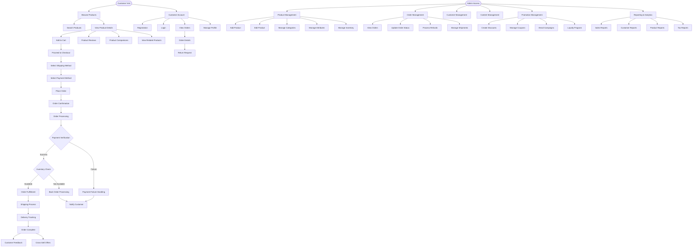

```mermaid
flowchart TD
    %% Main Customer Journey
    Start([Customer Visit]) --> Browse[Browse Products]
    Browse --> Search[Search Products]
    Browse --> ViewProduct[View Product Details]
    ViewProduct --> AddToCart[Add to Cart]
    AddToCart --> Checkout[Proceed to Checkout]
    Checkout --> SelectShipping[Select Shipping Method]
    SelectShipping --> SelectPayment[Select Payment Method]
    SelectPayment --> PlaceOrder[Place Order]
    PlaceOrder --> OrderConfirmation[Order Confirmation]
    OrderConfirmation --> OrderProcessing[Order Processing]
    
    %% Order Processing Flow
    OrderProcessing --> PaymentVerification{Payment Verification}
    PaymentVerification -->|Success| Inventory{Inventory Check}
    PaymentVerification -->|Failure| PaymentFailure[Payment Failure Handling]
    PaymentFailure --> NotifyCustomer[Notify Customer]
    
    Inventory -->|Available| Fulfillment[Order Fulfillment]
    Inventory -->|Not Available| BackOrder[Back Order Processing]
    BackOrder --> NotifyCustomer
    
    Fulfillment --> Shipping[Shipping Process]
    Shipping --> DeliveryTracking[Delivery Tracking]
    DeliveryTracking --> OrderComplete[Order Complete]
    
    %% Customer Account Processes
    Start --> CustomerAccount[Customer Account]
    CustomerAccount --> Registration[Registration]
    CustomerAccount --> Login[Login]
    CustomerAccount --> ViewOrders[View Orders]
    CustomerAccount --> ManageProfile[Manage Profile]
    ViewOrders --> OrderDetails[Order Details]
    OrderDetails --> ReturnRequest[Return Request]
    
    %% Admin Processes
    AdminAccess([Admin Access]) --> ProductManagement[Product Management]
    AdminAccess --> OrderManagement[Order Management]
    AdminAccess --> CustomerManagement[Customer Management]
    AdminAccess --> ContentManagement[Content Management]
    AdminAccess --> PromotionManagement[Promotion Management]
    AdminAccess --> ReportingAnalytics[Reporting & Analytics]
    
    %% Product Management Details
    ProductManagement --> AddProduct[Add Product]
    ProductManagement --> EditProduct[Edit Product]
    ProductManagement --> ManageCategories[Manage Categories]
    ProductManagement --> ManageAttributes[Manage Attributes]
    ProductManagement --> ManageInventory[Manage Inventory]
    
    %% Order Management Details
    OrderManagement --> ViewOrders2[View Orders]
    OrderManagement --> UpdateOrderStatus[Update Order Status]
    OrderManagement --> ProcessRefunds[Process Refunds]
    OrderManagement --> ManageShipments[Manage Shipments]
    
    %% Marketing Processes
    PromotionManagement --> CreateDiscounts[Create Discounts]
    PromotionManagement --> ManageCoupons[Manage Coupons]
    PromotionManagement --> EmailCampaigns[Email Campaigns]
    PromotionManagement --> LoyaltyProgram[Loyalty Program]
    
    %% Reporting
    ReportingAnalytics --> SalesReports[Sales Reports]
    ReportingAnalytics --> CustomerReports[Customer Reports]
    ReportingAnalytics --> ProductReports[Product Reports]
    ReportingAnalytics --> TaxReports[Tax Reports]
    
    %% Additional Customer Interactions
    ViewProduct --> ProductReviews[Product Reviews]
    ViewProduct --> ProductComparisons[Product Comparisons]
    ViewProduct --> RelatedProducts[View Related Products]
    
    %% Post-Purchase
    OrderComplete --> CustomerFeedback[Customer Feedback]
    OrderComplete --> CrossSellOffers[Cross-Sell Offers]
```
