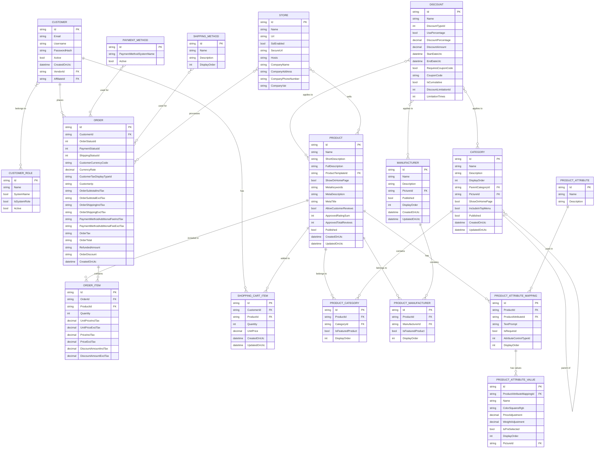

```mermaid
erDiagram
    CUSTOMER {
        string Id PK
        string Email
        string Username
        string PasswordHash
        bool Active
        datetime CreatedOnUtc
        string VendorId FK
        string AffiliateId FK
    }
    
    CUSTOMER_ROLE {
        string Id PK
        string Name
        bool SystemName
        bool IsSystemRole
        bool Active
    }
    
    PRODUCT {
        string Id PK
        string Name
        string ShortDescription
        string FullDescription
        string ProductTemplateId FK
        bool ShowOnHomePage
        string MetaKeywords
        string MetaDescription
        string MetaTitle
        bool AllowCustomerReviews
        int ApprovedRatingSum
        int ApprovedTotalReviews
        bool Published
        datetime CreatedOnUtc
        datetime UpdatedOnUtc
    }
    
    CATEGORY {
        string Id PK
        string Name
        string Description
        int DisplayOrder
        string ParentCategoryId FK
        string PictureId FK
        bool ShowOnHomePage
        bool IncludeInTopMenu
        bool Published
        datetime CreatedOnUtc
        datetime UpdatedOnUtc
    }
    
    MANUFACTURER {
        string Id PK
        string Name
        string Description
        string PictureId FK
        bool Published
        int DisplayOrder
        datetime CreatedOnUtc
        datetime UpdatedOnUtc
    }
    
    ORDER {
        string Id PK
        string CustomerId FK
        int OrderStatusId
        int PaymentStatusId
        int ShippingStatusId
        string CustomerCurrencyCode
        decimal CurrencyRate
        string CustomerTaxDisplayTypeId
        string CustomerIp
        string OrderSubtotalInclTax
        string OrderSubtotalExclTax
        string OrderShippingInclTax
        string OrderShippingExclTax
        string PaymentMethodAdditionalFeeInclTax
        string PaymentMethodAdditionalFeeExclTax
        string OrderTax
        string OrderTotal
        string RefundedAmount
        string OrderDiscount
        datetime CreatedOnUtc
    }
    
    ORDER_ITEM {
        string Id PK
        string OrderId FK
        string ProductId FK
        int Quantity
        decimal UnitPriceInclTax
        decimal UnitPriceExclTax
        decimal PriceInclTax
        decimal PriceExclTax
        decimal DiscountAmountInclTax
        decimal DiscountAmountExclTax
    }
    
    SHOPPING_CART_ITEM {
        string Id PK
        string CustomerId FK
        string ProductId FK
        int Quantity
        decimal UnitPrice
        datetime CreatedOnUtc
        datetime UpdatedOnUtc
    }
    
    PRODUCT_CATEGORY {
        string Id PK
        string ProductId FK
        string CategoryId FK
        bool IsFeaturedProduct
        int DisplayOrder
    }
    
    PRODUCT_MANUFACTURER {
        string Id PK
        string ProductId FK
        string ManufacturerId FK
        bool IsFeaturedProduct
        int DisplayOrder
    }
    
    PRODUCT_ATTRIBUTE {
        string Id PK
        string Name
        string Description
    }
    
    PRODUCT_ATTRIBUTE_MAPPING {
        string Id PK
        string ProductId FK
        string ProductAttributeId FK
        string TextPrompt
        bool IsRequired
        int AttributeControlTypeId
        int DisplayOrder
    }
    
    PRODUCT_ATTRIBUTE_VALUE {
        string Id PK
        string ProductAttributeMappingId FK
        string Name
        string ColorSquaresRgb
        decimal PriceAdjustment
        decimal WeightAdjustment
        bool IsPreSelected
        int DisplayOrder
        string PictureId FK
    }
    
    DISCOUNT {
        string Id PK
        string Name
        int DiscountTypeId
        bool UsePercentage
        decimal DiscountPercentage
        decimal DiscountAmount
        datetime StartDateUtc
        datetime EndDateUtc
        bool RequiresCouponCode
        string CouponCode
        bool IsCumulative
        int DiscountLimitationId
        int LimitationTimes
    }
    
    PAYMENT_METHOD {
        string Id PK
        string PaymentMethodSystemName
        bool Active
    }
    
    SHIPPING_METHOD {
        string Id PK
        string Name
        string Description
        int DisplayOrder
    }
    
    STORE {
        string Id PK
        string Name
        string Url
        bool SslEnabled
        string SecureUrl
        string Hosts
        string CompanyName
        string CompanyAddress
        string CompanyPhoneNumber
        string CompanyVat
    }
    
    CUSTOMER ||--o{ ORDER : "places"
    CUSTOMER ||--o{ SHOPPING_CART_ITEM : "has"
    CUSTOMER }|--o{ CUSTOMER_ROLE : "belongs to"
    
    PRODUCT ||--o{ PRODUCT_CATEGORY : "belongs to"
    PRODUCT ||--o{ PRODUCT_MANUFACTURER : "belongs to"
    PRODUCT ||--o{ PRODUCT_ATTRIBUTE_MAPPING : "has"
    PRODUCT ||--o{ ORDER_ITEM : "included in"
    PRODUCT ||--o{ SHOPPING_CART_ITEM : "added to"
    
    CATEGORY ||--o{ PRODUCT_CATEGORY : "contains"
    CATEGORY ||--o{ CATEGORY : "parent of"
    
    MANUFACTURER ||--o{ PRODUCT_MANUFACTURER : "contains"
    
    ORDER ||--o{ ORDER_ITEM : "contains"
    
    PRODUCT_ATTRIBUTE ||--o{ PRODUCT_ATTRIBUTE_MAPPING : "used in"
    
    PRODUCT_ATTRIBUTE_MAPPING ||--o{ PRODUCT_ATTRIBUTE_VALUE : "has values"
    
    DISCOUNT }o--o{ PRODUCT : "applies to"
    DISCOUNT }o--o{ CATEGORY : "applies to"
    DISCOUNT }o--o{ MANUFACTURER : "applies to"
    
    PAYMENT_METHOD }o--o{ ORDER : "used for"
    
    SHIPPING_METHOD }o--o{ ORDER : "used for"
    
    STORE }o--o{ ORDER : "processes"
    STORE }o--o{ PRODUCT : "sells"
```
