# GrandNode High-Level Architecture

```mermaid
flowchart TD
    %% Client Layer
    subgraph ClientLayer["Client Layer"]
        WebStore["Web Store Front"]
        AdminPanel["Admin Panel"]
        MobileApp["Mobile App"]
        API["API Endpoints"]
    end
    
    %% Presentation Layer
    subgraph PresentationLayer["Presentation Layer"]
        WebFramework["ASP.NET Core MVC"]
        ViewEngines["Razor View Engine"]
        UIComponents["UI Components"]
        APIControllers["API Controllers"]
    end
    
    %% Business Logic Layer
    subgraph BusinessLayer["Business Logic Layer"]
        Services["Core Services"]
        subgraph DomainServices["Domain Services"]
            CatalogService["Catalog Service"]
            OrderService["Order Service"]
            CustomerService["Customer Service"]
            MarketingService["Marketing Service"]
            ContentService["Content Service"]
            PaymentService["Payment Service"]
            ShippingService["Shipping Service"]
            SecurityService["Security Service"]
        end
        EventPublisher["Event Publisher"]
        Caching["Caching"]
    end
    
    %% Data Access Layer
    subgraph DataLayer["Data Access Layer"]
        Repositories["Repositories"]
        DataProviders["Data Providers"]
        QueryObjects["Query Objects"]
    end
    
    %% Infrastructure Layer
    subgraph InfrastructureLayer["Infrastructure Layer"]
        Logging["Logging"]
        Configuration["Configuration"]
        Authentication["Authentication"]
        Authorization["Authorization"]
        Localization["Localization"]
        FileStorage["File Storage"]
    end
    
    %% Data Storage
    subgraph DataStorage["Data Storage"]
        MongoDB[(MongoDB)]
        FileSystem[(File System)]
        Redis[(Redis Cache)]
    end
    
    %% External Systems
    subgraph ExternalSystems["External Systems"]
        PaymentGateways["Payment Gateways"]
        ShippingProviders["Shipping Providers"]
        TaxProviders["Tax Providers"]
        EmailService["Email Service"]
        ThirdPartyAPIs["Third-Party APIs"]
    end
    
    %% Plugin System
    subgraph PluginSystem["Plugin System"]
        PluginManager["Plugin Manager"]
        PaymentPlugins["Payment Plugins"]
        ShippingPlugins["Shipping Plugins"]
        TaxPlugins["Tax Plugins"]
        WidgetPlugins["Widget Plugins"]
        OtherPlugins["Other Plugins"]
    end
    
    %% Connections between layers
    ClientLayer --> PresentationLayer
    PresentationLayer --> BusinessLayer
    BusinessLayer --> DataLayer
    DataLayer --> DataStorage
    BusinessLayer --> InfrastructureLayer
    BusinessLayer <--> PluginSystem
    BusinessLayer <--> ExternalSystems
    
    %% Specific connections
    WebStore --> WebFramework
    AdminPanel --> WebFramework
    MobileApp --> APIControllers
    API --> APIControllers
    
    WebFramework --> Services
    APIControllers --> Services
    
    Services --> DomainServices
    Services --> EventPublisher
    Services --> Caching
    
    DomainServices --> Repositories
    Repositories --> DataProviders
    DataProviders --> MongoDB
    
    FileStorage --> FileSystem
    Caching --> Redis
    
    PaymentService <--> PaymentPlugins
    ShippingService <--> ShippingPlugins
    
    PaymentPlugins <--> PaymentGateways
    ShippingPlugins <--> ShippingProviders
    
    %% Style definitions
    classDef clientLayer fill:#f9d5e5,stroke:#333,stroke-width:1px;
    classDef presentationLayer fill:#eeac99,stroke:#333,stroke-width:1px;
    classDef businessLayer fill:#e06377,stroke:#333,stroke-width:1px;
    classDef dataLayer fill:#c83349,stroke:#333,stroke-width:1px;
    classDef infrastructureLayer fill:#5b9aa0,stroke:#333,stroke-width:1px;
    classDef dataStorage fill:#d6e5fa,stroke:#333,stroke-width:1px;
    classDef externalSystems fill:#f9cb9c,stroke:#333,stroke-width:1px;
    classDef pluginSystem fill:#b6d7a8,stroke:#333,stroke-width:1px;
    
    class ClientLayer clientLayer;
    class PresentationLayer presentationLayer;
    class BusinessLayer,DomainServices businessLayer;
    class DataLayer dataLayer;
    class InfrastructureLayer infrastructureLayer;
    class DataStorage,MongoDB,FileSystem,Redis dataStorage;
    class ExternalSystems,PaymentGateways,ShippingProviders,TaxProviders,EmailService,ThirdPartyAPIs externalSystems;
    class PluginSystem,PluginManager,PaymentPlugins,ShippingPlugins,TaxPlugins,WidgetPlugins,OtherPlugins pluginSystem;
```

## Architecture Layer Descriptions

### Client Layer
- **Web Store Front**: Customer-facing e-commerce interface
- **Admin Panel**: Back-office management interface
- **Mobile App**: Native mobile applications
- **API Endpoints**: RESTful API for third-party integrations

### Presentation Layer
- **ASP.NET Core MVC**: Web application framework
- **Razor View Engine**: Server-side HTML rendering
- **UI Components**: Reusable interface elements
- **API Controllers**: RESTful API implementation

### Business Logic Layer
- **Core Services**: Application services implementing business logic
- **Domain Services**: Specialized services for different business domains
- **Event Publisher**: Pub/sub system for loose coupling
- **Caching**: Performance optimization

### Data Access Layer
- **Repositories**: Data access abstractions
- **Data Providers**: Database-specific implementations
- **Query Objects**: Specialized data retrieval logic

### Infrastructure Layer
- **Logging**: Error and activity tracking
- **Configuration**: Application settings management
- **Authentication**: User identity verification
- **Authorization**: Access control
- **Localization**: Multi-language support
- **File Storage**: Document and media management

### Data Storage
- **MongoDB**: NoSQL document database
- **File System**: Physical storage for media files
- **Redis Cache**: In-memory data structure store

### External Systems
- **Payment Gateways**: Credit card and alternative payment processing
- **Shipping Providers**: Shipping rate calculation and label generation
- **Tax Providers**: Tax calculation services
- **Email Service**: Transactional and marketing email delivery
- **Third-Party APIs**: Integration with external services

### Plugin System
- **Plugin Manager**: Plugin discovery and loading
- **Payment Plugins**: Payment method implementations
- **Shipping Plugins**: Shipping method implementations
- **Tax Plugins**: Tax calculation implementations
- **Widget Plugins**: UI extension points
- **Other Plugins**: Additional functionality extensions
