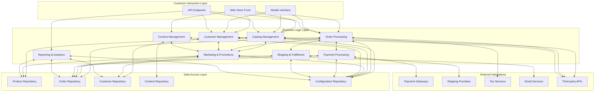

```mermaid
flowchart TD
    subgraph "Customer Interaction Layer"
        A1[Web Store Front]
        A2[Mobile Interface]
        A3[API Endpoints]
    end

    subgraph "Business Logic Layer"
        B1[Catalog Management]
        B2[Order Processing]
        B3[Customer Management]
        B4[Marketing & Promotions]
        B5[Content Management]
        B6[Payment Processing]
        B7[Shipping & Fulfillment]
        B8[Reporting & Analytics]
    end

    subgraph "Data Access Layer"
        C1[Product Repository]
        C2[Order Repository]
        C3[Customer Repository]
        C4[Content Repository]
        C5[Configuration Repository]
    end

    subgraph "External Integrations"
        D1[Payment Gateways]
        D2[Shipping Providers]
        D3[Tax Services]
        D4[Email Services]
        D5[Third-party APIs]
    end

    %% Customer Interaction to Business Logic
    A1 --> B1
    A1 --> B2
    A1 --> B3
    A1 --> B5
    A2 --> B1
    A2 --> B2
    A2 --> B3
    A3 --> B1
    A3 --> B2
    A3 --> B3
    A3 --> B8

    %% Business Logic Interconnections
    B1 <--> B4
    B2 <--> B4
    B2 <--> B6
    B2 <--> B7
    B3 <--> B4
    B5 <--> B4

    %% Business Logic to Data Access
    B1 <--> C1
    B2 <--> C2
    B3 <--> C3
    B4 <--> C1
    B4 <--> C2
    B4 <--> C3
    B5 <--> C4
    B6 <--> C2
    B7 <--> C2
    B8 <--> C1
    B8 <--> C2
    B8 <--> C3
    B1 <--> C5
    B2 <--> C5
    B3 <--> C5
    B4 <--> C5
    B5 <--> C5
    B6 <--> C5
    B7 <--> C5
    B8 <--> C5

    %% Business Logic to External Integrations
    B6 <--> D1
    B7 <--> D2
    B2 <--> D3
    B4 <--> D4
    B1 <--> D5
    B2 <--> D5
    B3 <--> D5
```
