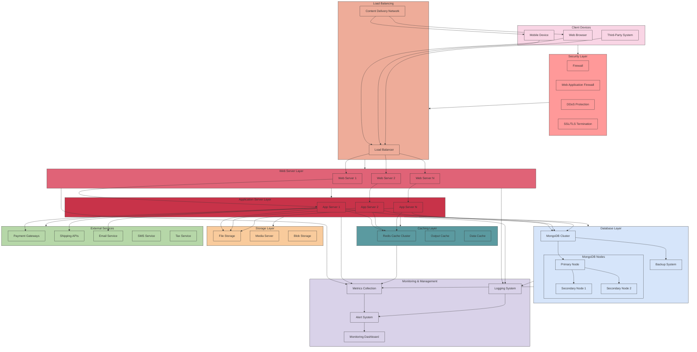

# GrandNode Infrastructure Diagram

## Infrastructure Components Description

### Client Devices
- **Web Browser**: Desktop and mobile browsers accessing the web store
- **Mobile Device**: Native mobile applications
- **Third-Party System**: External systems integrating via API

### Security Layer
- **Firewall**: Network security system monitoring and controlling incoming/outgoing traffic
- **Web Application Firewall**: Filters, monitors, and blocks HTTP traffic
- **DDoS Protection**: Mitigates distributed denial-of-service attacks
- **SSL/TLS Termination**: Handles encryption/decryption of secure connections

### Load Balancing
- **Load Balancer**: Distributes incoming network traffic across multiple servers
- **Content Delivery Network**: Geographically distributed network for fast content delivery

### Web Server Layer
- **Web Servers**: Handles HTTP requests, serves static content, and forwards dynamic requests

### Application Server Layer
- **App Servers**: Runs the GrandNode application, processes business logic

### Caching Layer
- **Redis Cache Cluster**: In-memory data structure store for high-performance caching
- **Output Cache**: Caches rendered HTML pages and partial views
- **Data Cache**: Caches database query results and application objects

### Database Layer
- **MongoDB Cluster**: NoSQL document database for storing application data
- **MongoDB Nodes**: Primary and secondary nodes for high availability
- **Backup System**: Regular data backups for disaster recovery

### Storage Layer
- **File Storage**: Stores product images, documents, and other media files
- **Media Server**: Optimizes and serves media content
- **Blob Storage**: Stores large binary objects

### External Services
- **Payment Gateways**: Processes credit card and alternative payment methods
- **Shipping APIs**: Calculates shipping rates and generates shipping labels
- **Email Service**: Sends transactional and marketing emails
- **SMS Service**: Sends text message notifications
- **Tax Service**: Calculates sales tax based on location

### Monitoring & Management
- **Logging System**: Collects and stores application logs
- **Metrics Collection**: Gathers performance metrics
- **Alert System**: Notifies administrators of issues
- **Monitoring Dashboard**: Visualizes system health and performance
