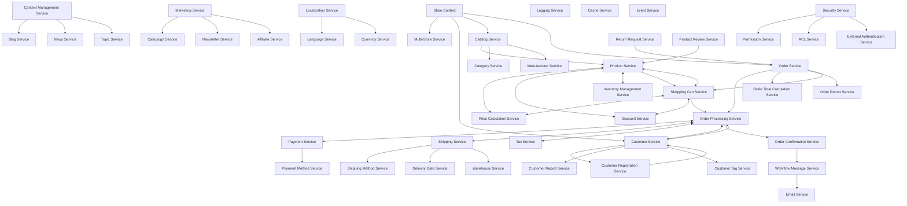

```mermaid
flowchart TD
    %% Core Services
    CatalogService[Catalog Service] --> ProductService[Product Service]
    CatalogService --> CategoryService[Category Service]
    CatalogService --> ManufacturerService[Manufacturer Service]
    
    OrderService[Order Service] --> OrderProcessingService[Order Processing Service]
    OrderService --> OrderTotalCalculationService[Order Total Calculation Service]
    OrderService --> OrderReportService[Order Report Service]
    OrderService --> ShoppingCartService[Shopping Cart Service]
    
    CustomerService[Customer Service] --> CustomerRegistrationService[Customer Registration Service]
    CustomerService --> CustomerReportService[Customer Report Service]
    CustomerService --> CustomerTagService[Customer Tag Service]
    
    PaymentService[Payment Service] --> PaymentMethodService[Payment Method Service]
    
    ShippingService[Shipping Service] --> ShippingMethodService[Shipping Method Service]
    ShippingService --> DeliveryDateService[Delivery Date Service]
    ShippingService --> WarehouseService[Warehouse Service]
    
    %% Service Interactions
    ProductService <--> PriceCalculationService[Price Calculation Service]
    ProductService <--> DiscountService[Discount Service]
    ProductService <--> InventoryService[Inventory Management Service]
    
    OrderProcessingService <--> PaymentService
    OrderProcessingService <--> ShippingService
    OrderProcessingService <--> TaxService[Tax Service]
    OrderProcessingService <--> CustomerService
    
    ShoppingCartService <--> ProductService
    ShoppingCartService <--> PriceCalculationService
    ShoppingCartService <--> DiscountService
    
    %% Content Services
    ContentService[Content Management Service] --> BlogService[Blog Service]
    ContentService --> NewsService[News Service]
    ContentService --> TopicService[Topic Service]
    
    %% Marketing Services
    MarketingService[Marketing Service] --> CampaignService[Campaign Service]
    MarketingService --> NewsletterService[Newsletter Service]
    MarketingService --> AffiliateService[Affiliate Service]
    
    %% Supporting Services
    LocalizationService[Localization Service] --> LanguageService[Language Service]
    LocalizationService --> CurrencyService[Currency Service]
    
    SecurityService[Security Service] --> PermissionService[Permission Service]
    SecurityService --> ACLService[ACL Service]
    SecurityService --> ExternalAuthService[External Authentication Service]
    
    %% Cross-cutting Services
    LoggingService[Logging Service]
    CacheService[Cache Service]
    EventService[Event Service]
    
    %% Main Workflows
    ProductService --> ShoppingCartService --> OrderProcessingService
    CustomerRegistrationService --> CustomerService --> OrderProcessingService
    
    %% Additional Connections
    OrderProcessingService --> OrderConfirmationService[Order Confirmation Service]
    OrderConfirmationService --> WorkflowMessageService[Workflow Message Service]
    WorkflowMessageService --> EmailService[Email Service]
    
    ReturnRequestService[Return Request Service] --> OrderService
    ProductReviewService[Product Review Service] --> ProductService
    
    %% Store Context
    StoreContext[Store Context] --> MultiStoreService[Multi-Store Service]
    StoreContext --> CustomerService
    StoreContext --> CatalogService
    StoreContext --> OrderService
```
