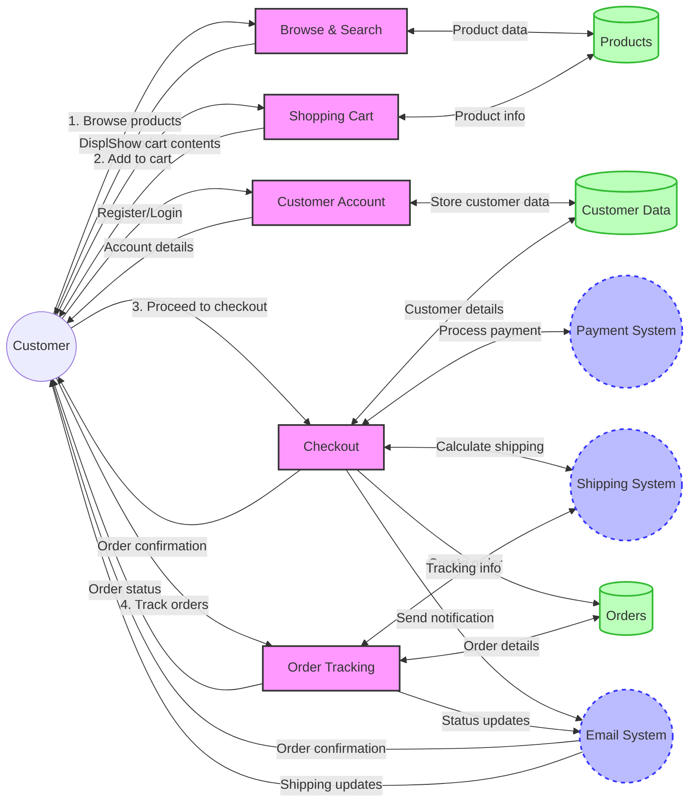

```mermaid
flowchart LR
    %% Main entities
    Customer((Customer))
    
    %% Core processes with clear labels
    Browse[Browse & Search]
    Cart[Shopping Cart]
    Account[Customer Account]
    Checkout[Checkout]
    Orders[Order Tracking]
    
    %% External systems
    Payment((Payment System))
    Shipping((Shipping System))
    Email((Email System))
    
    %% Simplified data stores
    ProductDB[(Products)]
    CustomerDB[(Customer Data)]
    OrderDB[(Orders)]
    
    %% Main customer interactions - browsing and shopping
    Customer --> |1. Browse products| Browse
    Browse --> |Display products| Customer
    Browse <--> |Product data| ProductDB
    
    Customer --> |2. Add to cart| Cart
    Cart --> |Show cart contents| Customer
    Cart <--> |Product info| ProductDB
    
    %% Account management
    Customer --> |Register/Login| Account
    Account --> |Account details| Customer
    Account <--> |Store customer data| CustomerDB
    
    %% Checkout flow
    Customer --> |3. Proceed to checkout| Checkout
    Checkout --> |Order confirmation| Customer
    Checkout <--> |Customer details| CustomerDB
    Checkout <--> |Process payment| Payment
    Checkout <--> |Calculate shipping| Shipping
    Checkout --> |Create order| OrderDB
    Checkout --> |Send notification| Email
    Email --> |Order confirmation| Customer
    
    %% Order tracking
    Customer --> |4. Track orders| Orders
    Orders --> |Order status| Customer
    Orders <--> |Order details| OrderDB
    Orders <--> |Tracking info| Shipping
    Orders --> |Status updates| Email
    Email --> |Shipping updates| Customer
    
    %% Style definitions to improve clarity
    classDef process fill:#f9f,stroke:#333,stroke-width:2px;
    classDef external fill:#bbf,stroke:#33f,stroke-width:2px,stroke-dasharray: 5 5;
    classDef database fill:#bfb,stroke:#3b3,stroke-width:2px;
    
    class Browse,Cart,Account,Checkout,Orders process;
    class Payment,Shipping,Email external;
    class ProductDB,CustomerDB,OrderDB database;
```
